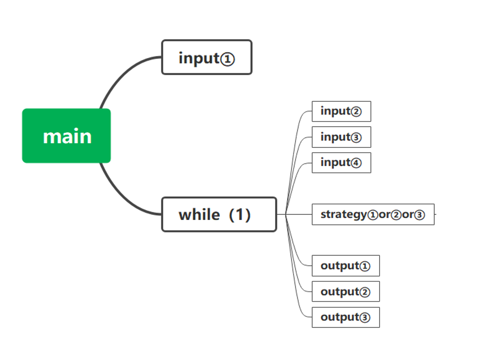

# 概要设计

## 数据结构设计

### 常量定义

```c
#define TRUE ( 1 )
#define FALSE ( 0 )
#define END ( -1 )
```

### 全局变量

```c
ENVIRONMENT env;
CAR         car;
STATION     station;
int         TIME = 0;
```

### 结构定义

```c
typedef struct {
    int TOTAL_STATION;
    int DISTANCE;
    enum { FCFS, SSTF, SCAN } STRATEGY;
} ENVIRONMENT;

typedef struct {
    int position;
    int target[ 2 ][ 11 ];
} CAR;

typedef struct {
    int clockwise[ 2 ][ 11 ];
    int counterclockwise[ 2 ][ 11 ];
} STATION;
```

## 系统模块划分

main.c input.c output.c strategy.c control.c

1. main.c：主函数

2. input.c：读文件、读指令

3. output.c：输出TIME、BUS、STATION的状态（后续版本增加图形界面输出）

4. strategy.c：策略
   根据当前车内请求和站台请求，结合所采用的策略，判断车应采取的行为



**input**

1. 读取配置文件
   
   ```c
   void readfile(FILE * fPtr);
   ```
- [x] 康京旸

2. 读取输入的字符串  
   `order * readOrder();`  
   `void FCFS_readOrder()`

- [x] 盛泽桓

3. 用于检查新请求是否已有相同的未完成请求，若有则抛弃新请求
   
   `int FCFS_checklist( int where, int stationNumber )`

- [x] 盛泽桓

4.释放链表

       `void FCFS_freeList( NODE* headPtr )`

- [x] 盛泽桓


**output**

1. 输出车状态、输出站台状态、输出时间
   
   ```c
   /**
   * 参数：ifOutPut
   * 为 TRUE 输出，
   * 为 FALSE 不输出，
   * 为 END 输出结束行。
   */
   void outPut( int ifOutPut );
   ```
- [x] 康京旸

内部函数：

```c
void printLines( void );
```

- [x] 康京旸

**strategy**

外部函数：

1. `void FCFS();`

- [x] 盛泽桓

3. `void SSTF();`
- [x] 康京旸

3. `void SCAN();`
- [x] 盛泽桓

内部函数：

> **stationNumber**: 站点的序号，从 1 开始  
> **positionIndex**: 位置的索引，从 0 开始  
> 一个 station 中间会有若干个 position ，本问题涉及两个序列。在此对命名进行规范。

1. ```c
   /**计算当前位置与目标位置之间的距离。
   * stationNumber：目标站号（从1开始）
   */
   int stationDistance( int stationNumber );
   ```
- [x] 瞿嘉辰
2. ```c
   /**寻找当前所有请求中最短的那个，
   * 返回到达用时最短的站台编号（从1开始）。
   * 如果无请求，就返回-1
   */
   int findNearestStationNumber( void );
   ```
- [x] 康京旸
3. ```c
   /**通过positionIndex计算对应的stationNumber，
   * 如果position在站点上，返回站台编号，
   * 如果所在position不是站点，返回-1。
   */
   int getStationNumber( int positionIndex );
   ```
- [x] 瞿嘉辰
4. ```c
   /**通过stationNumber计算对应的positionIndex，
   */
   int getPositionIndex( int stationNumber );
   ```
- [x] 瞿嘉辰

5.  

```c
/**完成输入stationNumber的请求
 * （把数组中的1改成0）
 */
void finishRequest(int stationNumber);
```

- [x] 康京旸
6. 

```c
/**车辆拟时针移动一个单位长度
 */
void carClockwise( void );

/**车辆拟时针移动一个单位长度
 */
void carCounterClockwise( void );
```

- [x] 瞿嘉辰
7.  

```c
/**检测car当前的位置有没有请求
 * direction: 1 顺时针，2 逆时针
 * 如果有，返回TRUE
 * 如果没有，返回FALSE
 * 如果当前位置不是车站，返回-1
 */
short haveRequest( short direction );
```

- [x] 瞿嘉辰
8. 

```c
/**用于FCFS策略中完成请求时从全局变量environment和car中去除对应请求
 */
void FCFS_finishRequest( int where, int stationNumber );
```

- [x] 康京旸
9. asd

```c
/*用于计算车前往当前目标站点采用的方向,顺时针返回1，逆时针返回2.
 */
int orient( int stationPosition );
```

- [x] 盛泽桓
10. 

```c
//返回某一方向的距离
int SCAN_stationDistance( int stationPosition, int state );
```

- [x] 瞿嘉辰
11.  

```c
void FCFS_haveOnStationRequest( NODE* presentWorkingPtr );
```

- [x] 康京旸
12.  

```c
void updateBuf( NODE* presentPtr );
```

- [x] 康京旸
13.  

```c
//用于检测是否有非当前位置请求，有则返回1，无则返回0
int AreThereAnyRequest( void );
```

- [x] 康京旸

6.

```c
/**车辆顺时针移动一个单位长度
 */
void carClockwise();

/**车辆拟时针移动一个单位长度
 */
void carCounterClockwise();
```

- [x] 康京旸

7.

```c
// 寻找在当前行驶方向上最近的车站
// 返回到达用时最短的站台编号
// 如果无请求返回-1
int SCANfindNearestStationNumber( int state );
```

- [x] 盛泽桓

8.

```c
/**计算当前位置与目标位置之间的距离。
 * stationNumber：目标站号（从1开始）
 * 返回positionIndex
 */
int stationDistance( int stationNumber );
```

- [x] 瞿嘉辰

9.

```c
/**检测car当前的位置有没有请求
 * direction: 1 顺时针，2 逆时针
 * 如果有，返回TRUE
 * 如果没有，返回FALSE
 * 如果当前位置不是车站，返回-1
 */
short haveRequest( short direction );
```

- [x] 瞿嘉辰

10.

```c
/**用于FCFS策略中完成请求时从全局变量environment和car中去除对应请求
 */
void FCFS_finishRequest( int where, int stationNumber );
```

- [x] 盛泽桓

11.

```c
/*用于计算车前往当前目标站点采用的方向,顺时针返回1，逆时针返回2.
 */
int orient( int stationPosition );
```

- [x] 盛泽桓

12.

```c
//返回某一方向的距离
int SCAN_stationDistance ( int stationPosition, int state);
```

- [x] 盛泽桓

