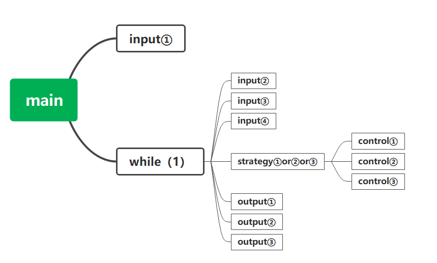

# 概要设计

## 数据结构设计

### 常量定义

```c
#define TRUE ( 1 )
#define FALSE ( 0 )
#define END ( -1 )
```

### 全局变量

```c
ENVIRONMENT env;
CAR         car;
STATION     station;
int         TIME = 0;
```

### 结构定义

```c
typedef struct {
    int TOTAL_STATION;
    int DISTANCE;
    enum { FCFS, SSTF, SCAN } STRATEGY;
} ENVIRONMENT;

typedef struct {
    int position;
    int target[ 2 ][ 11 ];
} CAR;

typedef struct {
    int clockwise[ 2 ][ 11 ];
    int counterclockwise[ 2 ][ 11 ];
} STATION;
```

## 系统模块划分

main.c input.c output.c strategy.c control.c

1. main.c：主函数

2. input.c：读文件、读指令

3. output.c：输出TIME、BUS、STATION的状态（后续版本增加图形界面输出）

4. strategy.c：策略
   根据当前车内请求和站台请求，结合所采用的策略，判断车应采取的行为

5. control.c：根据策略改变车和STATION的状态



**input**

1. 读取配置文件
   `void readfile(FILE * fPtr);`
- [x] 康京旸

2. 读取输入的字符串
   `order * readOrder();`
- [ ] 盛泽桓

**output**

1. 输出车状态、输出站台状态、输出时间
```c
/**
 * 参数：ifOutPut
 * 为 TRUE 输出，
 * 为 FALSE 不输出，
 * 为 END 输出结束行。
 */
void outPut( int ifOutPut );
```
- [x] 康京旸

内部函数：

```c
void printLines( void );
```
- [x] 康京旸

**strategy**

外部函数：

1. `void FCFS(digitalOrder * ORDER);`

2. `void SSTF(digitalOrder * ORDER);`
- [ ] 康京旸

3. `void SCAN(digitalOrder * ORDER);`

内部函数：

> **stationNumber**: 站点的序号，从 1 开始  
> **positionIndex**: 位置的索引，从 0 开始  
> 一个 station 中间会有若干个 position ，本问题涉及两个序列。在此对命名进行规范。

1. 

```c
/**计算当前位置与目标位置之间的距离。
 * stationNumber：目标站号（从1开始）
 */
int stationDistance( int stationNumber );
```

2. 
```c
/**寻找当前所有请求中最短的那个，
 * 返回到达用时最短的站台编号（从1开始）。
 * 如果无请求，就返回-1
 */
int findNearestStationNumber( void );
```
- [x] 康京旸

3. 
```c
/**通过positionIndex计算对应的stationNumber，
 * 如果position在站点上，返回站台编号，
 * 如果所在position不是站点，返回-1。
 */
int getStationNumber( int positionIndex );
```

4. 
```c
/**通过stationNumber计算对应的positionIndex，
 */
int getPositionIndex( int stationNumber );
```

