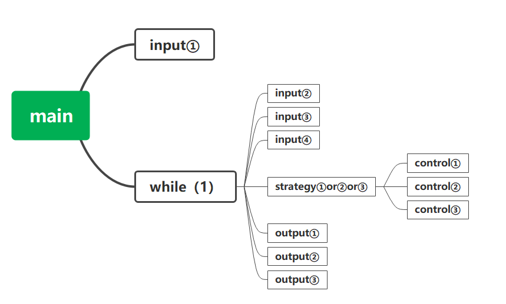

# 概要设计

# 

## 数据结构设计

### 常量定义

### 全局变量定义

```c
ENVIRONMENT * env;
CAR * car;
STATION * station;
```

### 数据结构定义

```C
typedef struct{
    int TOTAL_STATION;
    int DISTANCE;
    enum {FCFS, SSTF, SCAN} STRATEGY;
} ENVIRONMENT;
// 配置文件中的环境

typedef struct{
    int position;
    int target;
} CAR;
// 车对象

typedef struct{
    int clockwise;
    int counterclockwise;
} STATION;
// 站台对象
```

## 系统模块划分

main.c input.c output.c strategy.c control.c

1. main.c：主函数

2. input.c：读文件、读指令

3. output.c：输出TIME、BUS、STATION的状态（后续版本增加图形界面输出）

4. strategy.c：策略
   根据当前车内请求和站台请求，结合所采用的策略，判断车应采取的行为

5. control.c：根据策略改变车和STATION的状态




### 文件及函数组成
